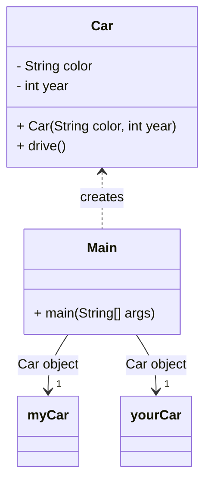
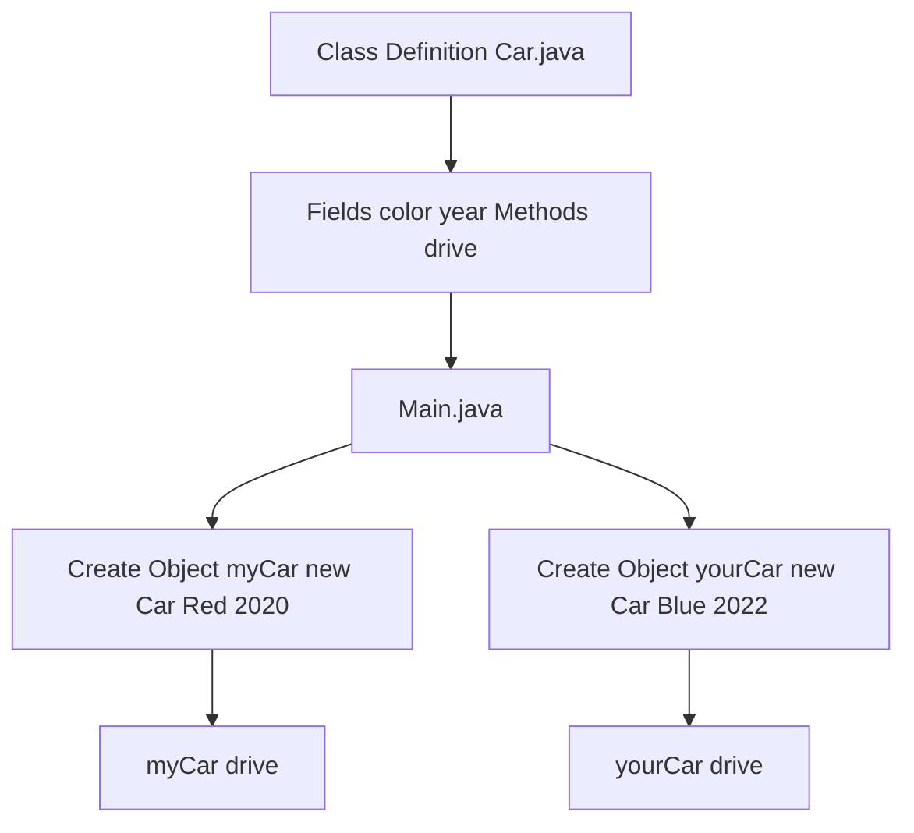

# Difference-Objects-Classes

## Discussion 1: Analyze the Difference Between Objects and Classes with Examples

In Java, objects and classes are central to object-oriented programming. Though often used together, they represent fundamentally different concepts.

---

### 📘 What is a Class?

A **class** is a *blueprint* for creating objects. It defines:
- **Fields** (also known as attributes or properties) that describe the object's state.
- **Methods** that describe the object's behavior.

For example, a class `Car` may have fields like `color` and `year`, and methods like `drive()` or `stop()`. The class itself does not perform any actions; it only defines what an object *can* do.

---

### 🚗 What is an Object?

An **object** is an *instance* of a class. It is a real, usable entity in memory that has the structure and behaviors defined by the class. You can create many objects from a single class, each with its own unique data.

For example:

```java
Car myCar = new Car("Red", 2020);
Car yourCar = new Car("Blue", 2022);
```

Here, `myCar` and `yourCar` are distinct objects of the same class.

---

### 📊 Visual Representation

#### Class Diagram


#### Flowchart


**Explanation:**
- **`Car`** is a *class*, defining structure and behavior.
- **`Main`** uses the `Car` class to create **two objects**: `myCar` and `yourCar`.
- The `Car <.. Main` arrow means "Main depends on Car".
- The `"1"` next to the arrows indicates that `Main` creates one instance per object.

---

### 🧠 Conceptual Differences

| Feature    | Class                                  | Object                              |
| ---------- | -------------------------------------- | ----------------------------------- |
| Definition | Blueprint for objects                  | Instance of a class                 |
| Memory Use | Does not use memory until instantiated | Uses memory                         |
| Usage      | Defines structure and behavior         | Performs actions and holds data     |
| Analogy    | Recipe                                 | Actual dish cooked using the recipe |

---

### 🛠️ Java Project Overview

This repository includes a Java project titled **Difference-Objects-Classes** which contains:

* A `Car` class that defines properties and behaviors.
* A `Main` class that creates and uses multiple `Car` objects.
* In-line comments explaining the difference between the class definition and the object instantiation.

The program has been compiled and run successfully with no syntax or logic errors.

---

### 📎 Repository Contents

* `Car.java` — defines the `Car` class (structure/blueprint)
* `Main.java` — contains the `main` method to create and run object examples
* Comments included in code highlight conceptual differences

---

### 🔗 How to Run

1. Clone the repository.
2. Open the project in any Java IDE (e.g., IntelliJ IDEA, Eclipse).
3. Compile and run `Main.java`.

---

### 📚 References

Oracle. (n.d.). *Object-Oriented Programming Concepts*. [https://docs.oracle.com/javase/tutorial/java/concepts/](https://docs.oracle.com/javase/tutorial/java/concepts/) 